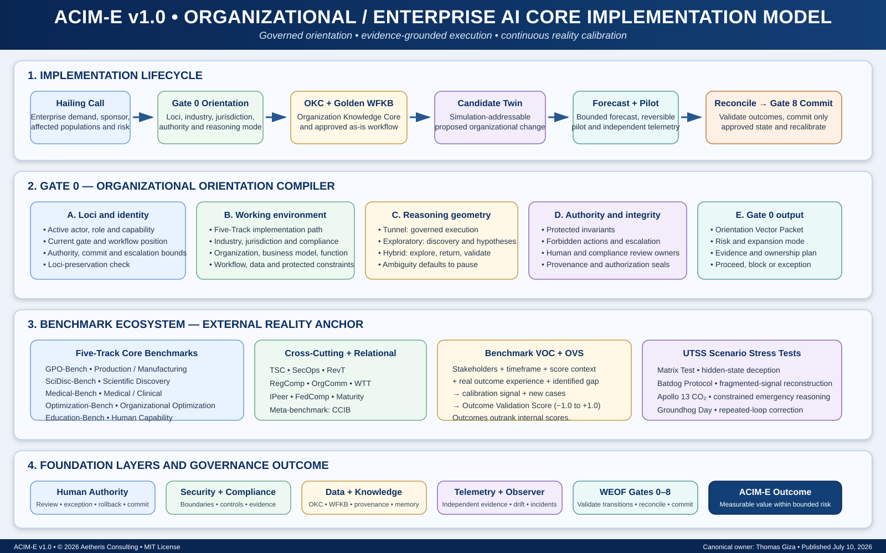

# ACIM-E v1.0

**Organizational / Enterprise AI Core Implementation Model**

ACIM-E is the enterprise implementation layer of the Aetheris AI Core Implementation Model. It converts ambiguous AI demand into bounded, evidence-grounded, reversible, measurable, and continuously calibrated organizational implementation.



## Canonical lifecycle

```text
Hailing Call
→ Gate 0 Orientation
→ Organization Knowledge Core
→ Golden Workflow Knowledge Baseline
→ Candidate Twin
→ Forecast
→ Reversible Pilot
→ Evaluated Deployment
→ Reconciliation
→ Gate 8 Controlled Commit
→ Continuous Telemetry and Benchmark Recalibration
```

## Start here

- [Canonical specification](./00-canonical-spec.md)
- [Gate 0 Orientation Gate module](../gate-0-orientation-gate/README.md)
- [Gate 0 Orientation Vector schema](./schemas/gate-0-orientation-vector.yaml)
- [Golden Workflow Knowledge Baseline schema](./schemas/golden-workflow-baseline.yaml)
- [Candidate Twin schema](./schemas/candidate-twin.yaml)
- [Benchmark VOC Cycle schema](./schemas/benchmark-voc-cycle.yaml)

## Governing doctrine

- Orient before govern.
- Baseline before optimize.
- Simulate before irreversible action.
- Pilot before scale.
- Validate before trust.
- Reconcile before commit.
- Outcomes outrank internal scores.
- Authority remains bounded.

## Status

- **Version:** 1.0
- **Date:** 2026-07-10
- **Owner:** Thomas Giza / Aetheris Consulting
- **Status:** Canonical working specification
- **Repository license:** MIT

The Google Drive document is the authoring source for this release. The Markdown and schemas in this directory are the repository-native publication artifacts.